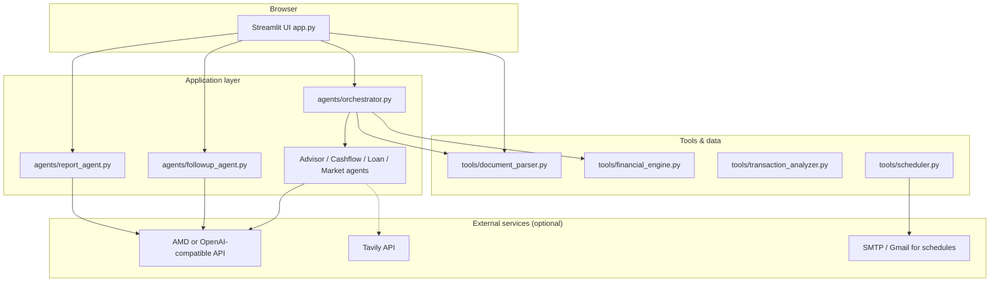
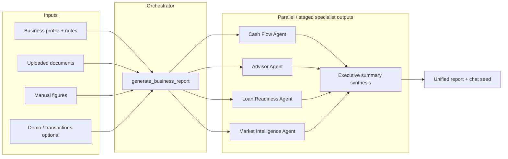
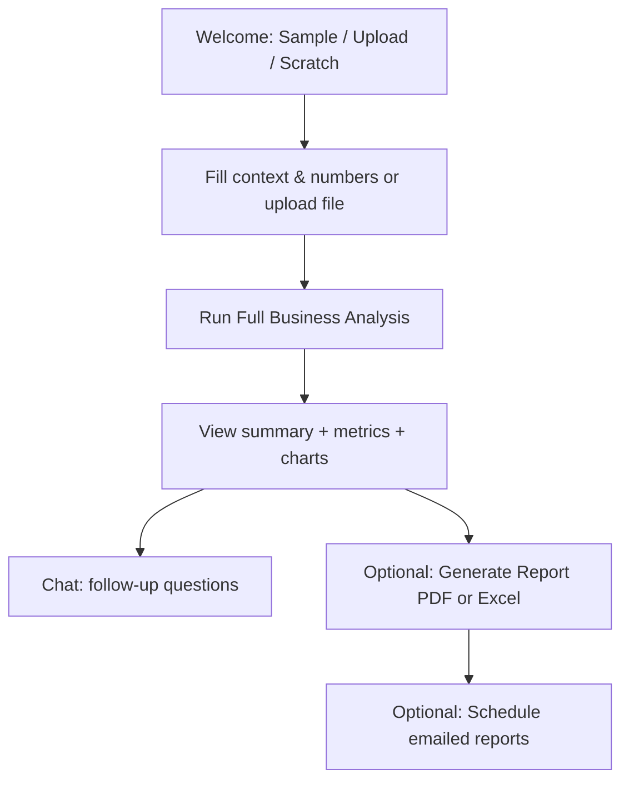

# Duka AI — SME Finance Workspace

**FinAfrica / finafrica** — An AI-assisted financial advisor web application for **small and medium enterprises (SMEs)**, with a focus on **Zambia and African market context**. Owners describe their business, supply numbers or documents, and receive **cash-flow insight**, **loan readiness**, **market intelligence**, **forecasts**, **reports** (PDF/Excel), and a **conversational follow-up** workspace.

**Initial documentation baseline:** 7 May 2026 — This README is intended as the single entry point for developers and operators: architecture, setup, configuration, data flow, testing, and operational notes.

---

## Table of contents

1. [What this project does](#what-this-project-does)
2. [Hackathon demo and judging](#hackathon-demo-and-judging)
3. [High-level architecture (sketch)](#high-level-architecture-sketch)
4. [Analysis & agent pipeline (sketch)](#analysis--agent-pipeline-sketch)
5. [User journey (sketch)](#user-journey-sketch)
6. [Tech stack](#tech-stack)
7. [Repository layout](#repository-layout)
8. [Prerequisites](#prerequisites)
9. [Installation](#installation)
10. [Configuration (environment variables)](#configuration-environment-variables)
11. [Running the application](#running-the-application)
12. [Testing](#testing)
13. [Data, samples, and templates](#data-samples-and-templates)
14. [Reports and exports](#reports-and-exports)
15. [Scheduling and email (optional)](#scheduling-and-email-optional)
16. [Security and secrets](#security-and-secrets)
17. [Troubleshooting](#troubleshooting)
18. [Contributing and review](#contributing-and-review)

---

## What this project does

| Area | Description |
|------|-------------|
| **Chat Advisor** | Main workflow: business profile → numbers from **upload**, **manual entry**, or **connected-style demo data** → **Run Full Business Analysis** → multi-agent report → chat follow-ups with routed specialist agents. |
| **Dashboard** | Summary metrics and visualizations when an analysis exists. |
| **Cash Flow Forecast** | Forward-looking views driven by financial engine / scenario data. |
| **Scenario Planner** | Explore financial scenarios. |
| **Loan Calculator** | Borrowing-related calculations and framing. |
| **Expense Analyzer** | Expense breakdown and insights. |
| **Generate Report** | Compiled **financial health report** with narrative + verified numbers; **PDF** (ReportLab) and **Excel/CSV** export. |
| **Market Intel** | Market-oriented intelligence (optional **Tavily** web search when configured). |
| **Settings** | App and provider-related configuration in the UI. |

**Verified numbers:** Core KPIs and report figures are computed in **Python** (`tools/financial_engine.py`, calculators); LLM outputs are grounded in those values where applicable (see `agents/report_agent.py` design notes).

---

## Hackathon demo and judging

Built for hackathons such as **[AMD Developer on lablab.ai](https://lablab.ai/ai-hackathons/amd-developer)** — an SME finance workspace in **Kwacha**, with a **live Hugging Face Space** so judges can try the app without uploading their own files.

### What runs where (for reviewers)

| Layer | Role |
|-------|------|
| **Python** (`tools/financial_engine.py`, parsers, calculators) | **Verified** revenue, expenses, profit, margins, forecasts, loan framing — every KPI the UI shows first. |
| **LLM on AMD (OpenAI-compatible API)** | Configured via `LLM_PROVIDER`, `AMD_BASE_URL`, `AMD_MODEL`, `AMD_API_KEY`. Used for **narrative** — summaries, recommendations, specialist chat — **grounded** in the verified figures passed in prompts. |
| **Optional Tavily** (`TAVILY_API_KEY`) | Live web snippets for **Market Intel** when the key is set on the host (e.g. Hugging Face Space secrets). |

### Suggested 5-minute demo flow

1. Open your **public Space URL** (deploy from this repo; see **`doc/huggingface-space-deploy.md`**).
2. Click **Try Demo Analysis** — judges see loaders and a full multi-agent run without bringing documents.
3. Walk through **Dashboard** → **Cash Flow Forecast** (chart + analyst chat) → **Expense Analyzer** (donut + **Expense Analyst** chat) → **Market Intel** → **Generate Report** → download **PDF / Excel**.
4. Say explicitly in voiceover: **numbers are computed in Python**; the **AMD MI300X / vLLM** stack serves the model through the **OpenAI-compatible** endpoint (`AMD_BASE_URL`).

### Why this stands out to judges

- **African SME context** and **Kwacha (K)** end-to-end — not a generic USD demo.
- **Verified math first**, AI explains — reduces hollow financial clichés.
- **Product depth**: forecast, scenarios, loan tools, reports, and routed agents — not a single chat box.

### Deployment notes

- **GitHub** holds code only; **API keys never go in the repo** (use `.env` locally, **Space secrets** on Hugging Face).
- Dockerized for Spaces (`Dockerfile`); configure secrets on the Space after push.

---

## High-level architecture (sketch)



---

## Analysis & agent pipeline (sketch)



---

## User journey (sketch)



---

## Tech stack

| Layer | Technology |
|-------|------------|
| UI | **Streamlit** (wide layout, custom CSS in `app.py`) |
| Language | **Python 3** |
| Data | **pandas**, **plotly** (charts) |
| Documents | **openpyxl**, **pypdf**, custom parsers in `tools/document_parser.py` |
| PDF reports | **reportlab** |
| LLM | **LangChain** **langchain-openai** (`ChatOpenAI`) — AMD MI300X endpoint or any OpenAI-compatible URL |
| Config | **python-dotenv** (`config.py` → `AppConfig`) |
| Tests | **pytest** |
| Scheduling | **APScheduler** (`tools/scheduler.py`) |

---

## Repository layout

```
finafrica/
├── app.py                 # Streamlit entrypoint: navigation, Chat Advisor, pages, PDF/Excel, styles
├── config.py              # Environment-driven AppConfig (LLM provider, keys, URLs)
├── requirements.txt       # Pinned minimum versions
├── .env.example           # Template for secrets (copy to .env — never commit .env)
├── agents/
│   ├── orchestrator.py    # Full business report composition
│   ├── advisor_agent.py
│   ├── cashflow_agent.py
│   ├── loan_agent.py
│   ├── market_intelligence_agent.py
│   ├── followup_agent.py  # Chat routing and specialist replies
│   ├── report_agent.py    # Structured full report for PDF/UI
│   ├── visualization_agent.py
│   └── __init__.py        # LLM helpers (get_chat_model, request_llm, streaming)
├── tools/
│   ├── document_parser.py
│   ├── financial_engine.py
│   ├── financial_calculator.py
│   ├── text_parser.py
│   ├── transaction_analyzer.py
│   ├── market_context.py
│   └── scheduler.py       # Report schedules + email hooks
├── prompts/               # Markdown prompts for agents (advisor, cashflow, loan, market, …)
├── data/                  # Sample CSVs, JSON cases, demo transactions
├── tests/                 # pytest modules
└── user_schedules.json    # Created at runtime when schedules are saved (gitignore locally if needed)
```

---

## Prerequisites

- **Python 3.10+** recommended (project tested with 3.13 in development).
- Access to an **OpenAI-compatible HTTP API**: default **`LLM_PROVIDER=amd`** (AMD-hosted **Qwen** / MI300X-style deployment), or **`LLM_PROVIDER=openai`** with your own base URL (local **vLLM**, etc.).
- Optional: **Tavily API key** for richer live market search.
- Optional: **Gmail app password** (or other SMTP) if you use scheduled email delivery — see scheduler and `.env.example`.

---

## Installation

```bash
git clone <your-repo-url>
cd finafrica
python -m venv .venv

# Windows
.venv\Scripts\activate

# macOS / Linux
source .venv/bin/activate

pip install -r requirements.txt
```

Copy environment template and fill in secrets:

```bash
copy .env.example .env    # Windows
# cp .env.example .env    # Unix
```

---

## Configuration (environment variables)

Values are read in `config.py` via `python-dotenv`. **Never commit `.env`** or API keys to Git.

| Variable | Purpose |
|----------|---------|
| `LLM_PROVIDER` | `amd` (default) or `openai` for a generic OpenAI-compatible endpoint. |
| `AMD_BASE_URL` | OpenAI-compatible base URL when using AMD deployment (`LLM_PROVIDER=amd`). |
| `AMD_API_KEY` | API key for AMD endpoint. |
| `AMD_MODEL` | Model id when using AMD (e.g. Qwen2.5). |
| `OPENAI_API_KEY` | API key when `LLM_PROVIDER=openai`. |
| `OPENAI_BASE_URL` | Base URL when `LLM_PROVIDER=openai` (e.g. local vLLM). |
| `MODEL_NAME` | Model id when `LLM_PROVIDER=openai`. |
| `TAVILY_API_KEY` | Optional — enables stronger web/market retrieval where implemented. |
| `APP_ENV` | e.g. `development`. |
| `GMAIL_ADDRESS` / `GMAIL_APP_PASSWORD` | Optional — used by scheduling/email flows in `tools/scheduler.py` (see code for exact usage). |

Refer to **`.env.example`** for the canonical list and placeholders.

---

## Running the application

```bash
streamlit run app.py
```

Then open the URL Streamlit prints (typically `http://localhost:8501`).

**Sidebar navigation** includes: Chat Advisor, Dashboard, Cash Flow Forecast, Scenario Planner, Loan Calculator, Expense Analyzer, Generate Report, Market Intel, Settings. A lightweight **navigation loader** overlay runs during page switches (implemented via injected HTML in `inject_navigation_loader()`).

---

## Testing

```bash
pytest
```

Optional verbosity:

```bash
pytest -v
```

Tests live under `tests/` (e.g. document parser, follow-up agent, calculator, parser, transactions).

---

## Data, samples, and templates

- **`data/sample_business_cases.json`** — Example narrative prompts (“pill” scenarios).
- **`data/sample_transactions.csv`** — Demo transactions for connected-style flows when enabled.
- **Sample CSV templates** — Income statement, cash flow, sales, expense, mobile money, etc., referenced from `app.py` (`SAMPLE_TEMPLATES`).
- **`data/sample_business_records.xlsx`** — Referenced as **General Business Workbook** if present in `data/`.

---

## Reports and exports

- **Generate Report** page builds a structured dict (`agents/report_agent.py`) and renders a styled HTML report in-app.
- **PDF**: `build_full_report_pdf()` in `app.py` uses **ReportLab** when installed; otherwise a minimal plaintext PDF fallback is used — ensure `reportlab` is in `requirements.txt` and installed.
- **Excel / CSV**: `build_excel_report_bytes()` produces spreadsheet export depending on **openpyxl** availability.

---

## Scheduling and email (optional)

`tools/scheduler.py` persists schedules to **`user_schedules.json`**, integrates **APScheduler**, and can send email with attachments when SMTP/Gmail variables are configured. Review that module before enabling in production (security, rate limits, spam compliance).

---

## Security and secrets

- Keep **all secrets in `.env`** and ensure `.env` is listed in **`.gitignore`** (do not push keys).
- Rotate API keys if leaked.
- Read-only market APIs and LLM calls should still be treated as sensitive business data in logs.

---

## Troubleshooting

| Symptom | Things to check |
|---------|-------------------|
| LLM errors / “model unavailable” | `LLM_PROVIDER`, `AMD_*` or `OPENAI_*` / `MODEL_NAME`, network, endpoint reachability. |
| PDF looks plain / ASCII-only | Install `reportlab`: `pip install reportlab`. |
| Market features weak | Set `TAVILY_API_KEY` if your deployment uses Tavily-backed search. |
| Import errors | Re-run `pip install -r requirements.txt` inside the active venv. |

---

## Contributing and review

- Use **pull requests**; **do not push secrets** to the remote repository.
- Follow team rules: **format/lint** before commit where applicable (e.g. **Black** for Python if adopted by the repo).
- **Pull requests should be reviewed** before merging; avoid direct pushes to **main** / production branches where policy applies.

---

## License

This project is released under the **MIT License** — see the [`LICENSE`](LICENSE) file in the repository root.

---

**Document version:** aligned with repository state as of **9 May 2026**. Update this file when adding major features, new env vars, or deployment targets.
